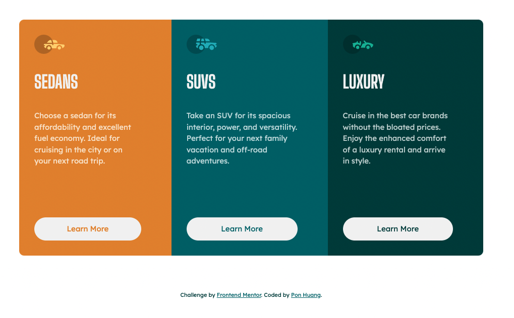
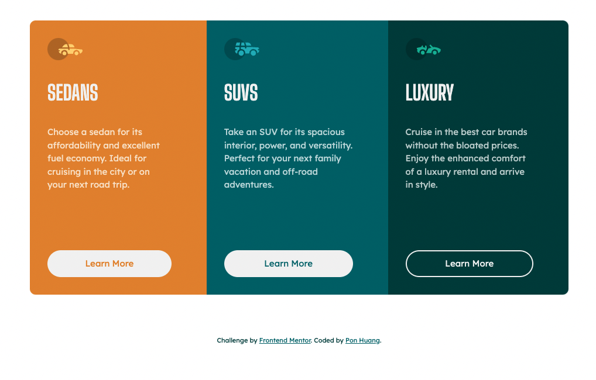
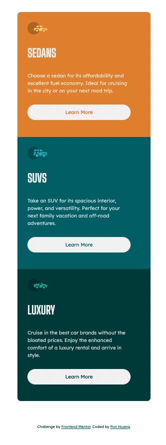

# Frontend Mentor - 3-column preview card component solution

This is a solution to the [3-column preview card component challenge on Frontend Mentor](https://www.frontendmentor.io/challenges/3column-preview-card-component-pH92eAR2-). Frontend Mentor challenges help you improve your coding skills by building realistic projects.

## Table of contents

- [Overview](#overview)
  - [The challenge](#the-challenge)
  - [Screenshot](#screenshot)
  - [Links](#links)
- [My process](#my-process)
  - [Built with](#built-with)
  - [What I learned](#what-i-learned)
  - [Continued development](#continued-development)
  - [Useful resources](#useful-resources)
- [Author](#author)
- [Acknowledgments](#acknowledgments)

**Note: Delete this note and update the table of contents based on what sections you keep.**

## Overview

### The challenge

Users should be able to:

- View the optimal layout depending on their device's screen size
- See hover states for interactive elements

### Screenshot

Desktop


Hover State


Mobile


### Links

- [Solution URL](https://github.com/ponhuang/3-column-preview-card)
- [Live Site URL](https://ponhuang.github.io/3-column-preview-card/)

## My process

### Built with

- Semantic HTML5 markup
- CSS custom properties
- Flexbox
- Desktop-first workflow

### What I learned

Learn how to use :nth-child() instead of setting every element with class name.

```css
.cards:nth-child(1) {
  border-radius: 10px 0 0 10px;
  background-color: var(--bright-orange);
}
```

### Useful resources

- [CSS :nth-child()](https://www.w3schools.com/cssref/sel_nth-child.asp) - explination from W3 school

## Author

Pon Huang

- Instagram - [Pon Huang](https://www.instagram.com/ponhuang/)
- Art Blog - [une felt](https://une722.wordpress.com)
